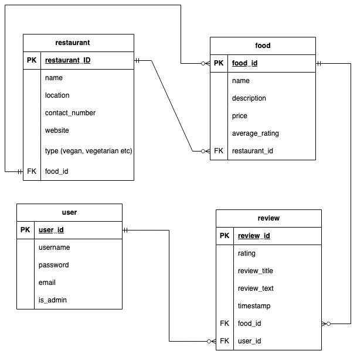

# Vegan Foodie API
### by Carmina Familar

### Purpose
The "Vegan Foodie" project is an API designed to connect to a database containing vegan food options at available at various restaurants and establishments. Users are able to search for food options offered at restaurants. Each restaurant will fall under one of the following types: "Vegan", "Vegetarian" and "Vegan Options Available". While most food review apps such as Google Maps and HappyCow focus on the establishment's rating, the Vegan Foodie focuses on individual food items where users are able to rate, read and write reviews about the food items available at each establishment, not on the establishment itself.

### R1. Identification of the problem you are trying to solve by building this particular app.

- **Lack of Specificity for Vegans:** Vegans often struggle to find suitable restaurants or food items that align with their strict plant-based diet. Mainstream review platforms may not provide enough information or filters to cater specifically to the vegan community, making it challenging to identify vegan-friendly options easily.

- **Quality Assurance:** Vegans need assurance that the food they consider trying at a restaurant is genuinely plant-based and adheres to vegan standards. Mislabeling of dishes as vegan or cross-contamination with non-vegan ingredients can be frustrating and discouraging for vegans.

- **Difficulty in Discovering Vegan-friendly Restaurants:** Many vegan-friendly restaurants or hidden gems might not receive widespread attention in mainstream food apps. Vegans face difficulty in discovering new places that cater to their dietary preferences and might miss out on exceptional vegan options.

- **Community Building:** There is a need for a platform that fosters a sense of community among vegans. Connecting with like-minded individuals, sharing experiences, and supporting businesses that prioritize vegan options can enhance the vegan lifestyle.

-  **Promotion of Veganism:** Creating a dedicated platform focused on vegan food reviews can contribute to the larger movement of promoting plant-based eating, sustainability, and ethical considerations in the food industry.

### R2. Why is it a problem that needs solving?

-  **Catering to Vegans' Specific Dietary Needs:** A vegan food review app addresses the unique dietary needs of vegans by providing a platform with filters and information specifically tailored to vegan-friendly restaurants and food items. This streamlines the process of finding suitable dining options.

-  **Enhancing Transparency and Trust:** By allowing users to share their experiences and insights, the app promotes transparency and trust. Vegans can rely on authentic reviews from fellow vegans, leading to a more enjoyable and trustworthy dining experience.

-  **Supporting Vegan-friendly Establishments:** The app's focus on hidden vegan gems and lesser-known restaurants supports businesses that prioritize vegan offerings. This exposure can contribute to the growth of such establishments and encourage more restaurants to add vegan options to their menus.

-  **Building a Supportive Community**: The community-building aspect of the app brings together individuals with shared values and interests. It fosters a sense of belonging and encourages users to engage actively, share recommendations, and support each other on their vegan journey.

-  **Promoting Sustainable and Ethical Food Choices:** The app's contribution to the promotion of veganism aligns with larger goals of reducing animal cruelty, supporting sustainable agriculture, and addressing environmental concerns related to the food industry.

### R3. Why have you chosen this database system. What are the drawbacks compared to others?

This application utilises the relational database manager PostgreSQL. It is a free, open-source RDBMS that is fully ACID compliant which assists in data integrity. It is also compatible with multiple operating systems including less common ones: Linux (all recent distributions), Windows (XP and later), FreeBSD, OpenBSD, NetBSD, macOS, AIX, HP/UX, and Solaris. It also has object-oriented features such as allowing one to define unique and complex data types.

### R4. Identify and discuss the key functionalities and benefits of an ORM

An ORM or Object Relational Mapping is the simplified connection between object-oriented programs and relational databases. For python, the most popular ORM's are Django, web2py, SQLObject and SQLAlchemy. The advantage is that development time and cost are reduced. The logic for interacting with the database are handles by the ORM. Security is also improved by as ORMs prevent SQL Injection. The drawback however is that it is time-consuming to learn and that ORMs are typically slower than SQL.

### R5. Document all endpoints for your API

### R6. An ERD for your app

### R7. Detail any third party services that your app will use

- **Flask** - Flask is a lightweight web application framework popular for web applications and API development. It provides the basic tools to get started and the developer can choose the architecture (typically this would be an MVC architecture).
- **SQL Alchemy** - SQL Alchemy is an open-source Python library providing an Object-Relational Mapping framework to allow developers to interact with relational databases using Python objects.
- **Marshmallow** - This python library is used for data marshaling which is the serialization and deserialization of objects. This allows developers to convert complex data types such as object into and from native Python data types. 
- **Flask-JWT-Extended** - Allows for JSON Web Tokens (JWT) to be used for Flask applications for protecting routes from unauthorized access.
- **Psycopg2** - Psycopg2 is a Python adapter for PostgreSQL databases. It establishes the connection between the python application and the PostgreSQL database.
- **Bcrypt** - Bcrypt is utilised to encrypt the passwords and store it into the database. Upon login, it also checks whether the encrypted password typed upon login matches with the encrypted password in the database. 
### R8. Describe your projects models in terms of the relationships they have with each other
There are four models used in this application: user, restaurant, food, and review. The user has a one to many relationship with the review. The food also has a one to many relationship with review. Finally, the f

### R9. Discuss the database relations to be implemented in your application

### R10. Describe the way tasks are allocated and tracked in your project

The project management tool used for this application was Trello. The link for the trello board is here: https://trello.com/invite/b/oxCO9kwF/ATTIaf232710e91f525c8453ea65e6202b87A517F357/vegan-food-review-api

### References
- https://www.freecodecamp.org/news/what-is-an-orm-the-meaning-of-object-relational-mapping-database-tools/
- https://www.prisma.io/dataguide/postgresql/benefits-of-postgresql
